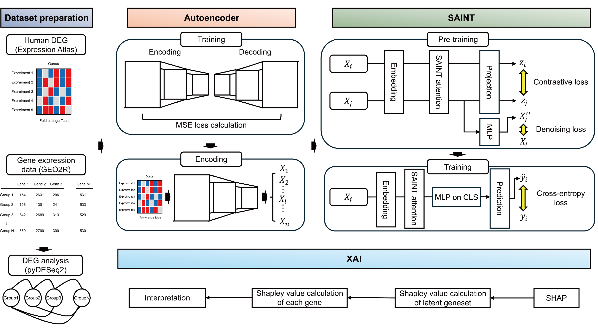

# SaintGSE: Transformer-based efficient and explainable gene set enrichment analysis



SaintGSE is an artificial intelligence model designed to predict human gene–pathway relationships using large-scale differentially expressed gene (DEG) datasets. By leveraging an autoencoder and the SAINT transformer model, SaintGSE addresses practical challenges in gene expression analysis, including data scarcity, model compatibility, and interpretability. This project uses and modifies code from the SAINT project (https://github.com/somepago/saint), licensed under the Apache License 2.0.

## Key features
- AI-driven pathway prediction: Uses an autoencoder and the SAINT model to analyze DEG signatures and predict associated signaling pathways.
- Osteoarthritis study: Applied to osteoarthritis (OA) to identify key pathways and potential therapeutic targets.
- Explainability (Integrated Gradients): Produces gene-level attributions via Integrated Gradients (IG) to identify influential genes supporting each pathway prediction.

## Installation

Before installation, we recommend building a conda environment from the attached YAML file and activating it. Our code has been tested with python=3.8 on Linux.

```bash
conda env create -f saintgse_env.yml
conda activate saintgse_env
```

Clone the repository and install the dependencies:

```bash
$ git clone https://github.com/MSjeon27/saintgse.git
$ cd saintgse
```

## Usage
### Step 0. Preprocessing the input DEG (from pyDESeq2 result)

Currently, SaintGSE has the function of converting mouse genes into human genes. The preprocessing code serves to change the human or mouse DEG data into the format used for SaintGSE.

* human DEGs
```bash
preprocessing.py --query_fc /path/to/your/DEGs.tsv --out Preprocessed_fc.
tsv
```

* mouse DEGs
```bash
preprocessing.py --query_fc /path/to/your/DEGs.tsv --org mouse --out Preprocessed_fc.tsv
```

### Step 1. training (optional) Train a pathway-specific model.
Available pathway names can be found in: <Path to SaintGSE>/datasets/pathway_list_in_DEG.txt

Training:
```bash
python SaintGSE.py --pathway "Proteins Involved in Osteoarthritis" --pretrain
```

### Step 2. Prediction through SaintGSE (Interpretation)

Run prediction for a target pathway using a pre-trained or previously trained checkpoint:

```bash
python SaintGSE.py --pathway "Proteins Involved in Osteoarthritis" --predict Preprocessed_fc.tsv
```

If IG is enabled, SaintGSE also produces gene-level attributions per sample. Typical outputs include:
- pathway_IG_sample_scores.tsv (sample-level pathway calibrated score; closer to 1 indicates stronger association, closer to 0 indicates weaker association)
- *_IG_gene_contributions.tsv (gene-level IG contributions per sample)

Recommended driver gene definition (cumulative |IG|): In our OA analyses, we observed that a compact subset of DEGs (approximately 7–20% of the DEG signature) often explained 50% of the total cumulative |IG|. We recommend defining informative genes as the smallest set of genes that cumulatively accounts for the top 50% of |IG| (top 50% of cumulative |IG|).

Note You can control IG computation via optional arguments:
- ig_steps (e.g., 10/20/50/100/256) (default: 64)
- ig_baseline (zero or mean) (default: zero)