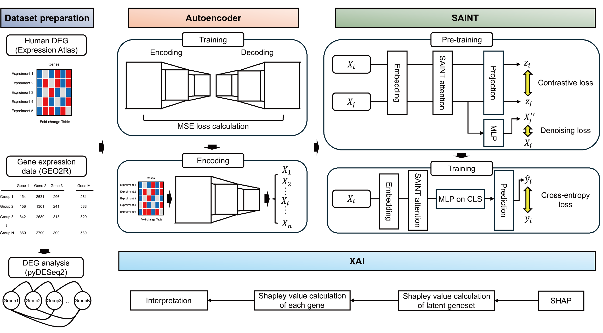

# SaintGSE: Transformer-based efficient and explainable gene set enrichment analysis



SaintGSE is an artificial intelligence model designed to predict human gene-pathway relationships using large-scale differentially expressed gene (DEG) datasets. By leveraging an autoencoder and the SAINT transformer model, SaintGSE overcomes challenges in gene expression analysis, such as data scarcity, model compatibility, and interpretability. This project uses and modifies code from the SAINT project (https://github.com/somepago/saint), licensed under the Apache License 2.0. 


## Key Features

  * AI-Driven Pathway Prediction: Uses autoencoders and the SAINT model to analyze gene expression data and predict related signaling pathways.

  * Osteoarthritis Study: Applied to osteoarthritis (OA) to identify key pathways and potential therapeutic targets.

  * Explainability: Utilizes Shapley additive explanations (SHAP) to interpret model predictions and identify influential genes.


## Installation

Before installation, we recommend to build a conda environment from the attached yml file and activate it.
Our code has been tested with python=3.8 on linux.

```
$ conda env create -f saintgse_env.yml
$ conda activate saintgse_env
```

Also, you could get additional dataset for prediction at github release (https://github.com/MSjeon27/SaintGSE/releases/tag/SaintGSE).

Additional datasets are divided into required and example files.
The list of required files is as follows.

```
AEshap.tar.gz
AE_100cycle_model.pth
AE_enrichment.tsv
```

These files must be located in the following path.

```
/path/to/SaintGSE/datasets/
```

After the training process, the model of SaintGSE is stored in the following directory path. The prediction process proceeds by referring to the model of the path. To proceed with the prediction through the model learned in our paper, create and store the following file in the additional datasets directory path stored in SaintGSE. The list of example files is as follows: they are optional and you can train them anew to create them.

```
Chronic_Myeloid_Leukemia.tar.gz
Direct_DNA_Repair.tar.gz
HPV_Entry_into_the_Keratinocyte.tar.gz
Hyperparathyroidism._Neonatal_Severe.tar.gz
Osteoarthritis.tar.gz
Proteins_Involved_in_Glioma.tar.gz
Proteins_Involved_in_Osteoarthritis.tar.gz
Proteins_with_Altered_Expression_in_Cancer-Associated_DNA_Methylation.tar.gz
Selencompound_Biosynthesis.tar.gz
```

These files must be located in the following path.

```
/path/to/SaintGSE/datasets/bestmodels/binary
```

In addition, after creating the corresponding path, you can decompress it with the following command in the path.

```
$ cd /path/to/SaintGSE/datasets/
$ find . -name "*.tar.gz" -exec tar -xzf {} -C $(dirname {}) \;
```

Once the file structure is formed as follows, the preparation for using SaintGSE is complete.

```
.
├── datasets
│   ├── AE_100cycle_model.pth
│   ├── AE_enrichment.tsv
│   ├── AEshap
│   │   ├── shap_values_latent_dim_1.csv
│   │   ├── shap_values_latent_dim_2.csv
│   │   ├── shap_values_latent_dim_3.csv
│   │   ├── ...
│   │   ├── ...
│   │   └── shap_values_latent_dim_256.csv
│   ├── bestmodels
│   │   └── binary
│   │       ├── Chronic_Myeloid_Leukemia
│   │       │   └── testrun
│   │       │       └── saint_gse_model.pth
│   │       │── ...
│   │       └── Selencompound_Biosynthesis
│   │           └── testrun
│   │               └── saint_gse_model.pth
│   ├── gene_list.pkl
│   ├── MGI_Gene_Model_Coord.tsv
│   └── pathway_list_in_DEG.txt
```

## DEG dataset preparation
Prior to SaintGSE analysis, prepare DEG data to be used as input in .tsv format as follows. In the column, the official gene symbol of DEGs is located, and the row adds the log2 fold change value in each DEG group. An example is as follows.

```
			LAP3	CD99	HS3ST1	MAD1L1	LASP1	SNX11
'mock-6' vs 'LPS-6'	-1.3	0	2.4	0	0.7	0
'mock-6' vs 'EBOV-6'	-1.3	0	2.3	0	0.6	0
```

## Usage

### Step 0. Preprocessing the input DEG (from pyDESeq2 result)

Currently, SaintGSE has the function of converting mouse genes into human genes. The preprocessing code serves to change the human or mouse DEG data into the format used for SaintGSE.

* human DEGs
```
$ preprocessing.py --query_fc /path/to/your/DEGs.tsv --out Preprocessed_fc.tsv
```

* mouse DEGs
```
$ preprocessing.py --query_fc /path/to/your/DEGs.tsv --org mouse --out Preprocessed_fc.tsv
```


### Step 1. Training SaintGSE for a target pathway

SaintGSE can be used to analyze new gene expression datasets for pathway prediction:

```
$ SaintGSE.py --pathway 'Proteins Involved in Osteoarthritis' --pretrain
```


### Step 2. Prediction through SaintGSE

```
$ SaintGSE.py --predict Preprocessed_fc.tsv --pathway 'Proteins Involved in Osteoarthritis'
```

The results of the predictions are as follows.

```
tensor([[1.]], device='cuda:0')
```

This indicates that your DEG data is related to the target signaling path.


### Step 3. Interpretation the result of SaintGSE (Get Relative SHAP contribution for each DEGs)
```
$ Interpret.py -d Preprocessed_fc.tsv -p 'Proteins Involved in Osteoarthritis'
```

The result of interpretation produces the following files for each sample.

```
<Sample_name>_<target_pathway>_significant_gene_shap.csv
```

This represents the relative SHAP contribution for each gene in the DEG data. In the subsequent analysis, it is recommended to focus on the genes with the relative SHAP contributions in the top 35% to 50% as we suggested in the paper, depending on the number of DEGs.
